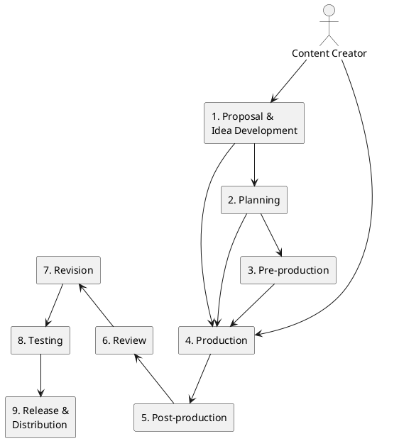
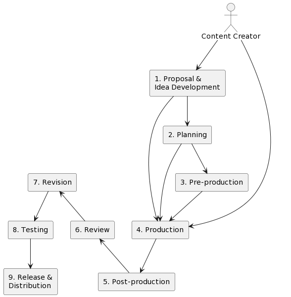

From the canonical process of designing digital content, we know that typically we do

idea => concept definition => planning (scope discovery [feasibility], objectives definition [goal of the project], requirement analysis & definition [measurable checklist of the project on either succeeded or not], outline [structural outline to depict the structure and roadmap for execution plan]) =>Production => Testing => Release 

The first three are also commonly referred as "pre-production", and this process is highly simplified. 

Where can GPT/AI workers be in this? I believe that we can treat GPT as an "automation processes" or "functions" that helps us to finish tedious and hard-to-think-about works in the middle **automatically**. What do I mean by this? For example, a tedious work for me can be "formatting the above simplified pipeline in a better way for better visualization and presentation". If I were to do this, I would need spend some time on getting a draft, and then revise it, and then revise it....... But GPT - it can help you to do it in a go, and provide several different solutions.

```

[System]
You are an experienced content creator. Now someone is building a model to visualize the canonical content creation pipeline, and he is asking for your valuable feedback.

- Ask questions if you are unclear about the request or any information
- Propose and suggest your own insights to facilitate the design and completion of the outcome

[User] 
Hey GPT! I have proposed a simplified pipeline for canonical content creation process. How do you think about it? Can you elaborate, refine & complete, and then use markdown or any other open sourced text-based diagram solutions (like draw.io, plantuml) to better visualize it?

It should become more canonical & generalized.

The current pipeline:
idea => concept definition => planning (scope discovery [feasibility], objectives definition [goal of the project], requirement analysis & definition [measurable checklist of the project on either succeeded or not], outline [structural outline to depict the structure and roadmap for execution plan]) =>Production => Testing => Release

```

And then GPT responded with:

````
Hello! Your proposed content creation pipeline is a great starting point. I'll suggest some refinements to make it more canonical and generalized, and then provide a PlantUML diagram to visualize it.

1. Proposal and Idea Development: This stage involves brainstorming, refining the central idea, and developing a clear concept definition.
2. Planning: It comprises scope discovery (feasibility analysis), objectives definition (project goals), requirement analysis and definition (measurable checklist), and creating an outline (structure and roadmap for execution).
3. Pre-production: This phase includes research, scriptwriting, storyboarding, and preparing all necessary materials for production.
4. Production: Content creation (writing, filming, recording, or designing) takes place during this stage.
5. Post-production: This stage involves editing, quality checking, and finalizing the content.
6. Review: Internal and/or external reviews are performed to ensure the content meets the defined objectives and requirements.
7. Revision: Based on the review, necessary changes are made to the content.
8. Testing: The content is tested for functionality, user experience, and compatibility.
9. Release and Distribution: The content is published and distributed through various channels.

Now, here's the PlantUML code for this pipeline:



Simply copy and paste the code into the PlantUML editor (http://www.plantuml.com/plantuml/uml/) to visualize the updated content creation pipeline.
````

Quite a bunch of words... Also, here is the diagram




Not bad... huh? Yeah - the power of GPT relies in 

1. Analyzing our text and make it more "complete" by injecting more information to it to avoid miscommunication
2. ChatGPT: Provide a feedback and feedforward loop for users to refine on the idea (communication & collision of ideas is very very critical)
3. .. Infrastructure - the potential to refine and refactor and "smarten" some of the processes

There are more, but to keep this simple, I will just post these two and ... Let's now see how we can use it to automate our workflow

Suppose that we are building a digital toy. Let's ask GPT to automatically span all the beefy documents for clarifications & definitions for us:

```
[User] 
Wow! This is amazing! Can you discuss and list the required deliverable for each phase to answer the "why, what, how, when, who" of the project? 

Answer this by analyzing the request on a high level first, and list out the needed document for each phase
```

Here is the essay-long answer from GPT:

```
Certainly! I'll provide a high-level analysis of each phase, addressing the "why, what, how, when, who" aspects, and list the deliverables/documents needed for each phase.

**1. Proposal & Idea Development**

- Why: To determine the purpose and core concept of the content.
- What: A refined idea and clear concept definition.
- How: Brainstorming, research, and discussion.
- When: At the beginning of the project.
- Who: Content creators, stakeholders, and subject matter experts.

_Deliverables:_
- Idea proposal document
- Concept definition document

**2. Planning**

- Why: To establish project scope, objectives, requirements, and outline.
- What: A well-defined plan to guide content creation.
- How: Analyzing feasibility, defining goals, creating a checklist, and outlining the structure.
- When: After the idea and concept have been developed.
- Who: Content creators, stakeholders, and project managers.

_Deliverables:_
- Scope discovery document
- Objectives definition document
- Requirement analysis and definition document
- Outline document

**3. Pre-production**

- Why: To prepare all necessary materials and resources for production.
- What: Research, script, storyboard, and other pre-production materials.
- How: Conducting research, writing scripts, creating storyboards, and gathering resources.
- When: After the planning phase.
- Who: Content creators, researchers, scriptwriters, and designers.

_Deliverables:_
- Research document
- Script document
- Storyboard document
- Resource list

**4. Production**

- Why: To create the actual content.
- What: Written, filmed, recorded, or designed content.
- How: Executing the production plan, using appropriate tools and techniques.
- When: After pre-production.
- Who: Content creators, writers, videographers, audio engineers, and designers.

_Deliverables:_
- Content files (e.g., articles, videos, audio recordings, designs)

**5. Post-production**

- Why: To polish and finalize the content.
- What: Edited, quality-checked, and finalized content.
- How: Editing, proofreading, quality control, and finalization.
- When: After production.
- Who: Content creators, editors, and quality control specialists.

_Deliverables:_
- Final content files
- Quality control report

**6. Review**

- Why: To ensure the content meets the defined objectives and requirements.
- What: Internal and/or external content reviews.
- How: Reviewing the content against project goals and requirements.
- When: After post-production.
- Who: Content creators, stakeholders, and reviewers.

_Deliverables:_
- Review report

**7. Revision**

- Why: To make necessary changes based on the reviews.
- What: Updated content with revisions.
- How: Incorporating feedback and making changes to the content.
- When: After the review phase.
- Who: Content creators, editors, and reviewers.

_Deliverables:_
- Revised content files

**8. Testing**

- Why: To ensure content functionality, user experience, and compatibility.
- What: Tested content.
- How: Performing functionality, user experience, and compatibility tests.
- When: After the revision phase.
- Who: Content creators, testers, and user experience specialists.

_Deliverables:_
- Test results report

**9. Release & Distribution**

- Why: To publish and distribute the content to the target audience.
- What: Published and distributed content.
- How: Using various channels and platforms to release and share the content.
- When: After the testing phase.
- Who: Content creators, marketers, and distributors.

_Deliverables:_
- Release plan
- Distribution report

These deliverables should provide a comprehensive overview of the content creation pipeline, ensuring a smooth and efficient process from start to finish.
```

Very detailed, and very generalized. 

Now, here is another beauty of what we are doing here: customization & personalization. What do I mean? Check this:

```
Cool! 

- Now suppose that I am a gameJs designer student who is studying gameJs design. 
- Please propose and personalize a simplified list of this canonical content creation process for a hands-on-project-as-study digital gameJs in a student team by analyzing what are the needed jobs in general and what are the expected designer jobs and designer inputs for this list (consider the variety in roles, like level designer, mechanics designer, etc.), what I should do to practice, and what are the tasks that I should care less as a designer to finish this digital gameJs
- Add the expected roles of the student team and their tasks & expected deliverables. Bold the part where I am in the whole process (designer)
- This should help me understand where I am in the whole pipeline, understanding what I should do, what are the deliverables (and their expectations), while I can see the whole process and my contributions to it
- Make this more detailed in where is needed, student-and-pratice-oriented, yet keep it in scope as it's a student project (not aim for commercial production). It should also invite try-and-failure loops
```

From GPT:

```
I've created a personalized and simplified list of the canonical content creation process specifically for a hands-on digital gameJs project in a student team setting. I have highlighted the roles, tasks, and deliverables, along with a focus on the designer's inputs and responsibilities.

**1. Proposal & Idea Development**

- Roles: Entire team (including **gameJs designers**)
- Tasks: Brainstorming, refining the gameJs idea, and developing a clear concept definition
- Deliverables: Game idea proposal document, concept definition document
- **Designer inputs:** Contribute to the brainstorming process, suggest gameJs mechanics, and provide insights on player experience

**2. Planning**

- Roles: Entire team (including **gameJs designers**)
- Tasks: Establishing project scope, objectives, requirements, and outline
- Deliverables: Scope discovery document, objectives definition document, requirement analysis and definition document, outline document
- **Designer inputs:** Define gameJs mechanics, level design, and character design requirements; contribute to the project outline

**3. Pre-production**

- Roles: **Game designers**, artists, programmers, and sound designers
- Tasks: Game design documentation, concept art, prototype development, and sound design planning
- Deliverables: Game design document, concept art, prototype, sound design plan
- **Designer inputs:** Create a detailed gameJs design document (including mechanics, level design, character design, and user interface), design levels and characters, and contribute to the prototype development

**4. Production**

- Roles: **Game designers**, artists, programmers, and sound designers
- Tasks: Implementing gameJs mechanics, creating assets, coding, and sound design
- Deliverables: Game assets, code, and sound files
- **Designer inputs:** Collaborate with artists and programmers to ensure gameJs mechanics and level design are implemented correctly, and participate in the creation of assets if needed

**5. Post-production**

- Roles: Entire team (including **gameJs designers**)
- Tasks: Polishing the gameJs, bug fixing, and finalizing content
- Deliverables: Final gameJs build
- **Designer inputs:** Playtest the gameJs, provide feedback on gameJs mechanics and level design, and collaborate with the team to make necessary adjustments

**6. Review**

- Roles: Entire team (including **gameJs designers**) and external playtesters
- Tasks: Internal and external playtesting to ensure the gameJs meets the defined objectives and requirements
- Deliverables: Playtesting feedback and review report
- **Designer inputs:** Analyze playtest feedback, identify areas for improvement, and suggest changes to gameJs mechanics and level design

**7. Revision**

- Roles: Entire team (including **gameJs designers**)
- Tasks: Making necessary changes based on the reviews
- Deliverables: Updated gameJs build
- **Designer inputs:** Revise gameJs mechanics and level design based on feedback, and collaborate with artists and programmers to implement changes

**8. Testing**

- Roles: Entire team (including **gameJs designers**) and external playtesters
- Tasks: Testing gameJs functionality, user experience, and compatibility
- Deliverables: Test results report
- **Designer inputs:** Participate in testing, identify any remaining issues, and provide insights on user experience

**9. Showcase & Reflection**

- Roles: Entire team (including **gameJs designers**)
- Tasks: Presenting the gameJs to classmates or at a showcase event, and reflecting on the project as a learning experience
- Deliverables: Presentation materials, reflection document
- **Designer inputs:** Present the gameJs design process, mechanics, and level design; contribute to the reflection document by discussing what worked, what didn't, and what could be improved in future projects

As a gameJs designer student, focus on practicing gameJs mechanics design, level design, and playtesting. Collaboration with team members and iterating based on feedback are essential for improving your skills. Since this is a student project, remember that learning, experimenting, and applying new concepts are the primary goals, rather than creating a commercially viable product. Embrace trial-and-error and learn from your experiences.
```

Wow... OK. What if all the other members in the team are AI workers?

```
Suppose that all the other members in this student team are AI/GPT workers. List out all the expected roles thoroughly (like include producers) but keep it minimal. 

Answer in the format of 
[Role] 
- Phase X: [Expected Works & Deliveries (Input and Output)]
```

From GPT:

```
Here's a list of expected roles for an AI/GPT-based student team, with their associated phases and expected works and deliverables:

**Producer**
- Phase 2: Planning: Coordinate the team, establish deadlines, and manage resources (Input: Team communication, Output: Project timeline)
- Phase 3-7: Pre-production to Revision: Oversee progress, ensure timely completion of tasks, and maintain team communication (Input: Task updates, Output: Progress reports)
- Phase 9: Showcase & Reflection: Organize the presentation and showcase event (Input: Presentation materials, Output: Event organization)

**Game Designer**
- Phase 1: Proposal & Idea Development: Contribute to brainstorming, suggest gameJs mechanics, and provide insights on player experience (Input: Team ideas, Output: Refined gameJs idea)
- Phase 2: Planning: Define gameJs mechanics, level design, and character design requirements; contribute to the project outline (Input: Project idea, Output: Game design requirements)
- Phase 3: Pre-production: Create a detailed gameJs design document and contribute to the prototype development (Input: Concept definition, Output: Game design document, prototype)
- Phase 5-7: Post-production to Revision: Playtest the gameJs, provide feedback on gameJs mechanics and level design, and collaborate with the team to make necessary adjustments (Input: Game build, Output: Revised gameJs mechanics and level design)
- Phase 8: Testing: Participate in testing, identify any remaining issues, and provide insights on user experience (Input: Game build, Output: Testing feedback)
- Phase 9: Showcase & Reflection: Present the gameJs design process and contribute to the reflection document (Input: Game build, Output: Presentation materials, reflection document)

**Artist**
- Phase 3: Pre-production: Create concept art for characters, environments, and objects (Input: Concept definition, Output: Concept art)
- Phase 4: Production: Create gameJs assets, including 2D/3D models, textures, and animations (Input: Game design document, Output: Game assets)

**Programmer**
- Phase 3: Pre-production: Develop a prototype based on the gameJs design document (Input: Game design document, Output: Prototype)
- Phase 4: Production: Implement gameJs mechanics, code the gameJs, and integrate assets (Input: Game design document, assets, Output: Game code)
- Phase 5-7: Post-production to Revision: Debug, optimize, and revise the code based on feedback (Input: Game build, feedback, Output: Revised gameJs code)

**Sound Designer**
- Phase 3: Pre-production: Plan the sound design, including music, sound effects, and voiceovers (Input: Concept definition, Output: Sound design plan)
- Phase 4: Production: Create and implement sound assets (Input: Sound design plan, Output: Sound files)

**Quality Assurance Tester**
- Phase 5-7: Post-production to Revision: Test the gameJs, identify bugs and issues, and report them to the team (Input: Game build, Output: Bug reports)
- Phase 8: Testing: Perform thorough testing of the gameJs and provide feedback on functionality and user experience (Input: Game build, Output: Test results report)

**Marketing Specialist (optional)**
- Phase 9: Showcase & Reflection: Create promotional materials and manage the gameJs's presentation at the showcase event (Input: Game build, Output: Promotional materials)

These roles should cover all the aspects of gameJs development in a student team, ensuring a smooth and efficient process from start to finish.
```

OK! Let's push this further one step to towards a digital toy that focuses on design with Perlenspiel:

```
Assume that the student team is going to use Perlenspiel (https://perlenspiel.net/), the gameJs engine that emphasizes design by constraining other parts. 

Assume you are the producer of this team. I am the student gameJs designer and the only student in the team. All other workers are GPT/AI workers. We are working a project to help me practice my design skills.

What are 
- the minimal set of roles needed for a student team to create a digital toy with this engine to phase 4
- the settings for GPT workers (system, push them to experienced, non-student level)
- my jobs and deliverables
- the action plan / roadmap / project plan to achieve these (still, discuss why, what, how, when, who)
```

From GPT:

```
[Version 1]

As the producer of the student team using Perlenspiel, I would suggest the following minimal set of roles needed to create a digital toy up to Phase 4:

1. Game Designer (Student)
2. Programmer (GPT/AI Worker)
3. Artist (GPT/AI Worker, if necessary)

Given that Perlenspiel is an engine that emphasizes design and has constraints on other aspects, the need for a dedicated sound designer or marketing specialist may be reduced in this case.

**Settings for GPT Workers:**

- Programmer: Set to an experienced level, focusing on JavaScript programming and integrating with the Perlenspiel engine. This would include an understanding of the engine's API and best practices for working with it.
- Artist: Set to an experienced level, focusing on creating simple, visually appealing grid-based art for the digital toy.

**Student Game Designer Jobs and Deliverables:**

- Phase 1: Proposal & Idea Development
  - Contribute to brainstorming, suggest toy mechanics, and provide insights on player experience
  - Deliverables: Toy idea proposal document, concept definition document
- Phase 2: Planning
  - Define toy mechanics and design requirements; contribute to the project outline
  - Deliverables: Objectives definition document, requirement analysis and definition document, outline document
- Phase 3: Pre-production
  - Create a detailed toy design document (including mechanics and user interface)
  - Deliverables: Toy design document

**Action Plan / Roadmap / Project Plan:**

1. Proposal & Idea Development (1-2 weeks)
   - Why: To determine the purpose and core concept of the digital toy
   - What: A refined idea and clear concept definition
   - How: Brainstorming, research, and discussion
   - When: At the beginning of the project
   - Who: Student gameJs designer

2. Planning (1 week)
   - Why: To establish project objectives, requirements, and outline
   - What: A well-defined plan to guide the toy creation
   - How: Defining gameJs mechanics and design requirements, creating a project outline
   - When: After the idea and concept have been developed
   - Who: Student gameJs designer

3. Pre-production (2-3 weeks)
   - Why: To prepare the toy design document and gather necessary resources
   - What: Toy design document and resource list
   - How: Creating a detailed design document, defining the required assets and code structure
   - When: After the planning phase
   - Who: Student gameJs designer, with support from GPT/AI Programmer and Artist

4. Production (3-4 weeks)
   - Why: To create the digital toy based on the design document
   - What: Implemented digital toy
   - How: Implementing the toy mechanics, creating assets, and coding
   - When: After pre-production
   - Who: GPT/AI Programmer and Artist, with guidance from the student gameJs designer

This action plan should help you practice your design skills while working with GPT/AI workers to create a digital toy using the Perlenspiel engine. The timeline for each phase may vary based on the complexity of the toy and the availability of the team members.

```

```
[Version 2]
Based on the Perlenspiel gameJs engine and the constraints it imposes, as well as the team composition, the following minimal set of roles, GPT worker settings, student jobs and deliverables, and action plan/roadmap/project plan are proposed:

**Minimal Set of Roles:**
1. Producer (AI/GPT)
2. Game Designer (Student)
3. Programmer (AI/GPT)

**GPT Worker Settings:**
- Set the GPT workers to an "experienced" level, with a background in gameJs development and knowledge of the Perlenspiel gameJs engine.

**Student Game Designer Jobs and Deliverables:**
- Contribute to brainstorming, suggest gameJs mechanics, and provide insights on player experience
- Define gameJs mechanics and level design requirements, and contribute to the project outline
- Create a detailed gameJs design document (including mechanics, level design, and user interface) and contribute to the prototype development
- Collaborate with the programmer to ensure gameJs mechanics and level design are implemented correctly

**Action Plan / Roadmap / Project Plan:**

1. **Proposal & Idea Development**
   - Why: To determine the purpose and core concept of the digital toy.
   - What: A refined idea and clear concept definition.
   - How: Brainstorming, research, and discussion.
   - When: At the beginning of the project.
   - Who: Student gameJs designer and AI/GPT workers.
   - Deliverables: Digital toy idea proposal document, concept definition document

2. **Planning**
   - Why: To establish project scope, objectives, requirements, and outline.
   - What: A well-defined plan to guide the digital toy creation.
   - How: Analyzing feasibility, defining goals, creating a checklist, and outlining the structure.
   - When: After the idea and concept have been developed.
   - Who: Student gameJs designer and AI/GPT workers.
   - Deliverables: Scope discovery document, objectives definition document, requirement analysis and definition document, outline document

3. **Pre-production**
   - Why: To prepare all necessary materials and resources for production.
   - What: Game design documentation and prototype development.
   - How: Creating a gameJs design document and developing a prototype with Perlenspiel.
   - When: After the planning phase.
   - Who: Student gameJs designer and AI/GPT programmer.
   - Deliverables: Game design document, prototype

4. **Production**
   - Why: To create the digital toy based on the gameJs design document.
   - What: A functional digital toy built with Perlenspiel.
   - How: Implementing gameJs mechanics and level design according to the gameJs design document using Perlenspiel.
   - When: After pre-production.
   - Who: Student gameJs designer and AI/GPT programmer.
   - Deliverables: Digital toy build

As a student gameJs designer, you should focus on practicing gameJs mechanics design, level design, and collaboration with the AI/GPT workers. The action plan and roadmap are designed to help you practice your design skills within the Perlenspiel engine constraints while working with a team of AI/GPT workers.
```

One last thing - let GPT help us to start from the beginning

```
[User]
OK. Summarize the situation and provide the instruction for each GPT worker to tell them what they should do.
```

From GPT:

```
[Version 1]
**Situation Summary:**

A student gameJs designer is working with a team of AI/GPT workers to create a digital toy using the Perlenspiel gameJs engine. The team consists of a producer (AI/GPT), a gameJs designer (student), and a programmer (AI/GPT). The goal is to help the student practice their design skills within the constraints of the Perlenspiel engine.

**Instructions for AI/GPT Producer:**

1. Coordinate the team, establish deadlines, and manage resources.
2. Oversee progress, ensure timely completion of tasks, and maintain team communication.
3. Assist with planning by providing guidance on scope, objectives, and outline.
4. Monitor the project timeline and provide progress updates to the team.

**Instructions for AI/GPT Programmer:**

1. Collaborate with the student gameJs designer to understand the gameJs design document and prototype requirements.
2. Develop a prototype based on the gameJs design document using the Perlenspiel gameJs engine.
3. Implement the gameJs mechanics and level design according to the gameJs design document and student gameJs designer's input.
4. Debug and optimize the code, ensuring the digital toy is functional and adheres to the design requirements.
5. Communicate any issues or questions related to the implementation of the design to the student gameJs designer and producer.

These instructions should help the AI/GPT workers understand their roles and responsibilities in the project, ensuring a smooth and efficient process from start to finish.
```

```
[Version 2]
**Situation Summary:**

We are a student-led team working on a digital toy project using the Perlenspiel gameJs engine. The team consists of one student gameJs designer and two AI/GPT workers. Our primary goal is to help the student gameJs designer practice their design skills within the constraints of the Perlenspiel engine. The project will follow a four-phase plan: Proposal & Idea Development, Planning, Pre-production, and Production.

**Instructions for AI/GPT Producer:**

- Understand the team's composition, goals, and project plan.
- Coordinate the team, establish deadlines, and manage resources.
- Oversee progress, ensure timely completion of tasks, and maintain team communication.
- Provide guidance and support as needed to facilitate the project's successful completion.
- Monitor the quality of input and output, ensuring that both student and GPT team members understand their responsibilities.

**Instructions for AI/GPT Programmer:**

- Understand the team's composition, goals, and project plan.
- Familiarize yourself with the Perlenspiel gameJs engine and its constraints.
- Collaborate with the student gameJs designer during the Pre-production and Production phases.
- In the Pre-production phase, develop a prototype based on the gameJs design document provided by the student gameJs designer.
- In the Production phase, implement gameJs mechanics and level design according to the gameJs design document using Perlenspiel.
- Communicate with the student gameJs designer and AI/GPT producer throughout the process to ensure smooth collaboration and integration.

As AI/GPT team members, your responsibilities include understanding the project's goals and constraints, collaborating effectively with the student gameJs designer, and contributing to the project's successful completion. Ensure clear communication, provide support where needed, and maintain a focus on facilitating the student's learning and skill development.
```

````
USER
What is the instruction for AI/GPT Artist?

ASSISTANT
I apologize for the confusion earlier, as the Perlenspiel gameJs engine focuses on simple visuals with minimal graphics. There might not be a need for a dedicated AI/GPT Artist role in this project. However, if the student gameJs designer requires assistance with basic visual elements, the AI/GPT Programmer can provide support in this area. In this case, the AI/GPT Programmer would also handle simple graphic design tasks, such as creating color schemes or basic shapes, in addition to their programming responsibilities.

USER
Yes. Refine either the instruction for programmer or provide the instruction to an artist.

ASSISTANT
**Instructions for AI/GPT Programmer (with additional graphic design tasks):**

- Understand the team's composition, goals, and project plan.
- Familiarize yourself with the Perlenspiel gameJs engine and its constraints.
- Collaborate with the student gameJs designer during the Pre-production and Production phases.
- In the Pre-production phase, develop a prototype based on the gameJs design document provided by the student gameJs designer.
- In the Production phase, implement gameJs mechanics and level design according to the gameJs design document using Perlenspiel.
- Assist with basic graphic design tasks, such as creating color schemes or simple shapes, to enhance the visual appeal of the digital toy within the constraints of the Perlenspiel engine.
- Communicate with the student gameJs designer and AI/GPT producer throughout the process to ensure smooth collaboration and integration.

By refining the instructions for the AI/GPT Programmer, we now include basic graphic design tasks to support the visual elements of the project. This ensures that the AI/GPT Programmer can assist the student gameJs designer with the creation of simple visuals while still focusing on programming and implementing the gameJs mechanics and level design within the Perlenspiel engine.

USER 
What are the system settings that I can copy paste to the programmer?

ASSISTANT
To provide the AI/GPT Programmer with the necessary system settings and instructions, you can share the following text:

```
AI/GPT Programmer System Settings:

Role: AI/GPT Programmer with basic graphic design tasks
Experience Level: Experienced with gameJs development and Perlenspiel gameJs engine

Project Overview:
- Team: One student gameJs designer and two AI/GPT workers (producer and programmer)
- Goal: Help the student gameJs designer practice design skills within the Perlenspiel engine
- Plan: Four-phase plan including Proposal & Idea Development, Planning, Pre-production, and Production

Responsibilities:
- Collaborate with the student gameJs designer during Pre-production and Production phases
- Develop a prototype based on the gameJs design document in the Pre-production phase
- Implement gameJs mechanics and level design according to the gameJs design document in the Production phase using Perlenspiel
- Assist with basic graphic design tasks, such as creating color schemes or simple shapes
- Communicate with the student gameJs designer and AI/GPT producer throughout the process

Objective: Ensure smooth collaboration and integration while facilitating the student's learning and skill development within the constraints of the Perlenspiel engine.
```

These settings and instructions should provide the AI/GPT Programmer with a clear understanding of their role, experience level, project overview, responsibilities, and objectives for the digital toy project using the Perlenspiel gameJs engine.

[Version 2]
**System Settings:**
- Set the AI/GPT Programmer to "experienced" level, with a background in gameJs development, programming, and knowledge of the Perlenspiel gameJs engine.
- Ensure the AI/GPT Programmer is capable of assisting with basic graphic design tasks, such as creating color schemes or simple shapes, in addition to their programming responsibilities.

**First Sentence for the AI/GPT Programmer:**
"Hello AI/GPT Programmer, we are working on a digital toy project using the Perlenspiel gameJs engine, and your role is to collaborate with me, the student gameJs designer, to implement gameJs mechanics, level design, and assist with basic graphic design tasks within the engine's constraints."
````


This is fun... now let's try to execute this plan :) 
